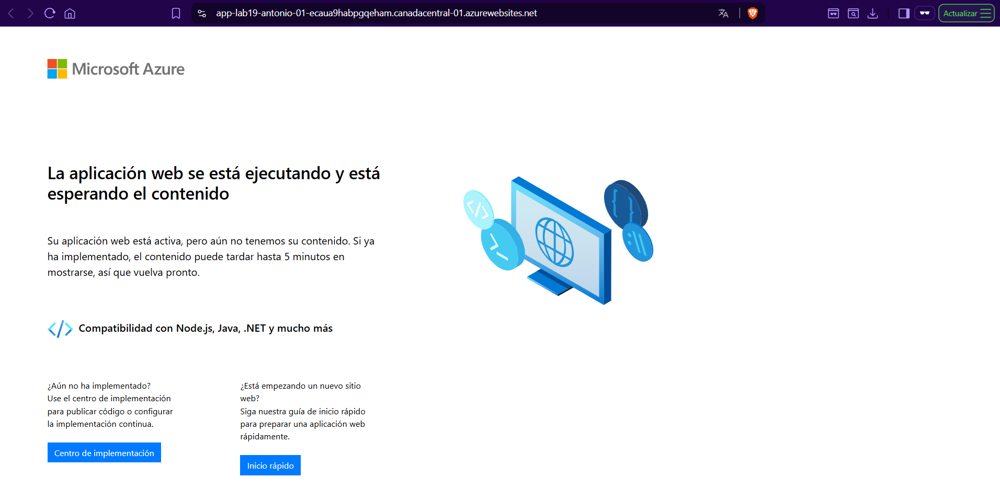

# Lab 19 – Azure App Service (PaaS) – Despliegue básico y verificación

## Objetivo
Desplegar una aplicación web en Azure App Service (PaaS) para publicar un endpoint web sin gestionar máquinas virtuales, sistema operativo ni parches.

El objetivo es simular un escenario real donde se necesita exponer una web rápidamente y de forma gestionada, utilizando el dominio por defecto `*.azurewebsites.net`.

---

## Qué he hecho en este laboratorio

1. He creado un App Service (Web App) en Azure.
2. He creado un App Service Plan asociado (capacidad y coste).
3. He seleccionado Runtime Stack .NET.
4. He validado el funcionamiento accediendo a la URL pública `*.azurewebsites.net` y comprobando que carga la página de bienvenida por defecto.

---

## Arquitectura y concepto

En App Service el despliegue se apoya en dos elementos:

- App Service (Web App): el recurso donde vive la aplicación (configuración, URL, runtime).
- App Service Plan: la capacidad sobre la que corre la app (SKU, CPU/RAM, escalado) y donde se define el coste.

Este enfoque PaaS permite publicar una web sin administrar el sistema operativo ni el servidor web, reduciendo la carga operativa y acelerando el despliegue.

---

## Configuración utilizada

- Región: AS
- App Service: `app-lab19-antonio-01`
- App Service Plan: `asp-lab19-antonio-01`
- Runtime Stack: `.NET`
- Endpoint por defecto: `https://app-lab19-antonio-01.azurewebsites.net`

---

## Validación funcional

Se ha verificado que la web responde correctamente accediendo a la URL por defecto del App Service y visualizando la página de bienvenida.

Esto confirma que:
- El App Service está creado y operativo.
- El endpoint público es accesible.
- El runtime está preparado para despliegues posteriores (Zip Deploy, GitHub Actions, etc.).

---

## Evidencias

### 01 – App Service creado (Overview)

Se muestra el panel del App Service, con el estado del servicio y la URL `*.azurewebsites.net`.

---

### 02 – Web accesible desde `azurewebsites.net`

Se muestra la página de bienvenida funcionando, accediendo al endpoint público por defecto del App Service.

---

## Checklist de verificación

- [x] App Service creado correctamente
- [x] App Service Plan creado y asociado
- [x] Runtime Stack configurado (.NET)
- [x] El App Service está en estado Running
- [x] La URL `*.azurewebsites.net` responde y carga la página de bienvenida
- [x] Evidencias guardadas y enlazadas en el README

---

## Qué le diría a un cliente o en entrevista

“Uso App Service cuando quiero desplegar una web sin administrar servidores. Azure gestiona el sistema operativo y el runtime, y yo me centro en la aplicación. El coste y capacidades dependen del App Service Plan, y puedo escalar o automatizar despliegues con pipelines.”

---
